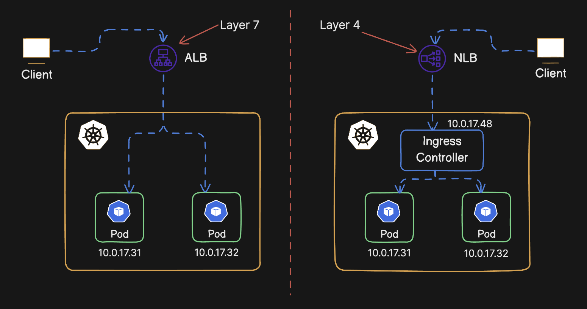

- Add k8s + EKS icon here

Experimental Kubernetes configurations on AWS EKS

# Table of contents

## VPC

- We define Public/Private route tables and attach them to four subnets. The public route table will by default route to Internet Gateway (request will be routed using default route when destination IP address is outside of the VPC). The private route table will by default route to NAT Gateway (allowing VM's with private IP to reach Internet).
- Internet Gateway: Provides internet access to any virtual machine that has public IP address and located in public subnet.
- NAT Gateway: Placed in one of the public subnets, it is used to translate private VM's IP addresses into a public one, providing internet access within private subnets.
- Options for Load Balancers: `Native Ingress` provided by `AWS Load Balancer Controller` OR open source `NGINX Ingress` provided by `NGINX Ingress Controller`
- Az Zones: Separate data centers, improves availability.

## EKS Cluster and Node Group

- EKS Cluster:
  - Attach the policy `AmazonEKSClusterPolicy` to the eks cluster terraform resource (using role assumtion).

- EKS Node Group:
  - Internally eks node groups creates EC2 ASG (Auto scaling group), provide `instance_types` and `scaling_config` for the ASG.
  - We can have different types of node groups, CPU optimized node groups, Memory optimized node groups, GPU optimized node groups based on the type of instance and scaling configurations.
  - Attach the policy `AmazonEKSWorkerNodePolicy`, `AmazonEKS_CNI_Policy`, `AmazonEC2ContainerRegistryReadOnly` to the eks node group terraform resource (using role assumtion).

## IAM User and IAM Role in EKS

- Create a `aws_eks_access_entry` terraform resource that can attach either an IAM User or IAM Role to kubernetes RBAC group in the cluster.
- Specify the eks permissions in the IAM policy which will then be attached to either an IAM User or IAM Role.
- Setup new user aws profile in local aws cli: `aws configure --profile developer`
- Update local kubeconfig to use the new user: `aws eks update-kubeconfig -—region eu-central-1 -—name cluster-name --profile developer`

## Autoscalers (HPA and Cluster)

- HPA (Horizontal POD Autoscaler):
  - HPA will scale the pods horizontally based on configured average resource utilization metrics.
  - Install metrics server on the cluster using helm before deploying HPA.

- Cluster Autoscaler:
  - The cluster autoscaler alters the scaling configuration of the ASG to provision new kubernetes nodes in the node group.
  - Create a IAM policy for cluster autoscaler to access AWS ASG. Attach this policy to a role and then use `aws_eks_pod_identity_association` terraform resource to associate this role with kubernetes service account (EKS POD Identity).
  - Install cluster autoscaler on the cluster using helm.

## Ingress (AWS LBC & NGINX Ingress)

The legacy Cloud controller manager which when used created a classic load balancer and was part of the k8s source code is now deprecated. We now use two options to setup Ingress:

- AWS Load balancer controller (Installed using helm)
  - Use EKS POD Identity to link with a IAM policy (using role assumtion) to a kubernetes service account.
  - Install AWS LBC using helm.
  - [LBC 1- NLB (http)](https://github.com/anirudhaxe/eks-sandbox/commit/a2757b2166c09929f3c05ad31f8fe4dccea522fd)
  - [LBC 2- (INGRESS-ALB) (http)](https://github.com/anirudhaxe/eks-sandbox/commit/a6d95a684fe6064d2130bf3bcf1b90c96b019ff9)
  - [LBC 3- (INGRESS-ALB) (+ACM SSL) (https)](https://github.com/anirudhaxe/eks-sandbox/commit/4ef536641fd7fefde4513b4dd69327554fded531)
- Nginx Ingress controller (Installed using helm)
  - Install Nginx Ingress controller using helm.
  - Install Cert Manager using helm.
  - [NGINX INGRESS-1 - NLB (http)](https://github.com/anirudhaxe/eks-sandbox/commit/6c3c03161ae727be46dff8eb16048448075895db)
  - [NGINX INGRESS-2 - NLB (https) - (Cert - Manager helm installation)](https://github.com/anirudhaxe/eks-sandbox/commit/fa4b4f7566240c7229fb7a85ad152bb53336c433)

## CSI Drivers (EBS-CSI, EFS-CSI)

The Container Storage Interface (CSI) driver a standardized API that enables storage vendors (like AWS) to integrate their storage systems with Kubernetes without modifying the core Kubernetes code.
For deploying a statefulset in EKS we use EBS/EFS CSI driver to mount native AWS storge as volumes in our statefulset.

- EBS (Elastic Block Store) CSI Driver:
  - EBS needs manual resizing and it is "ReadWriteOnce".
  - Use EKS POD Identity to link with a IAM policy (using role assumtion) to a kubernetes service account.
  - Install EBS CSI driver using helm.
  - Define a `volumeClaimTemplates` in k8s resource of kind `StatefulSet`. After deplyment, a pvc (persistent volume claim) will be created in the cluster.

- EFS (Elastic File Store) CSI Driver:
  - Scalable and shared file system, does not need manual resizing and it is "ReadWriteMany".
  - Use openid connect provider and link k8s service account with IAM Role (eks pod identities not supported in efs-csi yet).
  - Use `aws_efs_file_system` type terraform resource to configure and deploy EFS file system in AWS (attach to multiple subnets).
  - Create a `PersistentVolumeClaim` kind k8s resource and attach it in the `volumes` property of any pod.

## EKS + Secrets Manager (AWS-Secrets-CSI)

- Use openid connect provider and link k8s service account with IAM Role (connected to the IAM policy granting the application access to a specific secret in aws).
- Install `https://kubernetes-sigs.github.io/secrets-store-csi-driver/charts` (CSI driver) and `https://aws.github.io/secrets-store-csi-driver-provider-aws` (CSI driver provider) using helm.
- In the Cluster: Add a k8s resource of type `SecretProviderClass`. Link k8s service account with the IAM role using the annotations using k8s resource of kind `ServiceAccount`.
- In the Pod: create a volume from the created secret class.

## License

MIT
